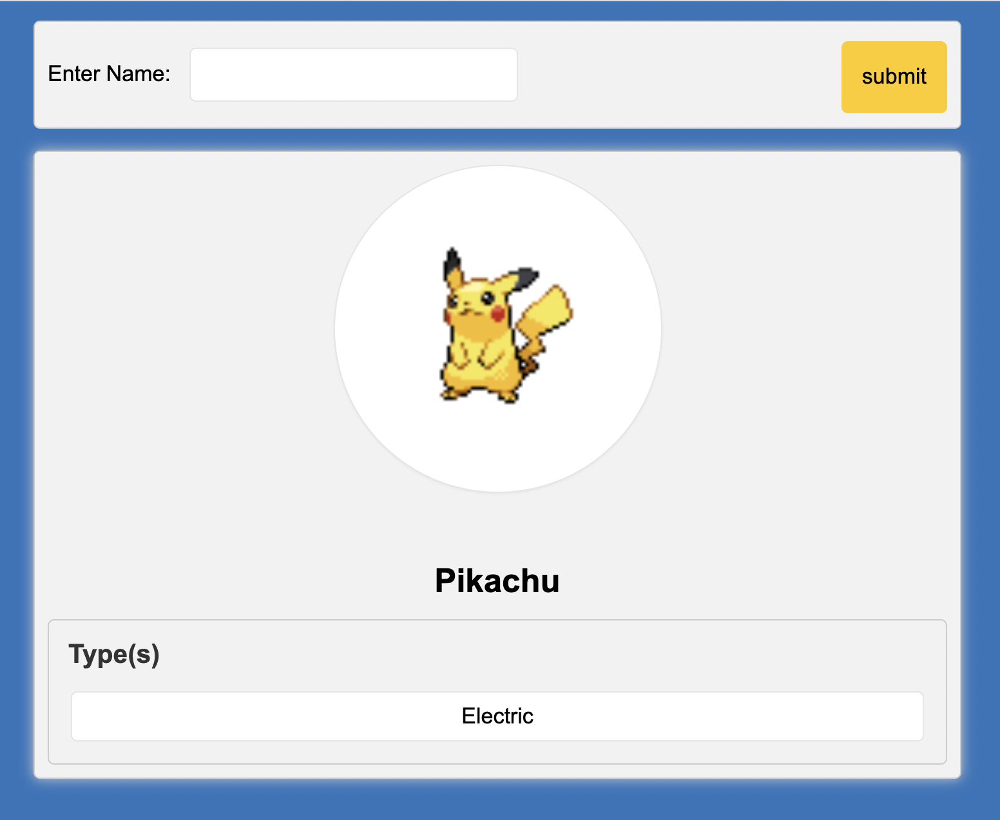

# flask-pokedex 

A simple Flask application that allows the user to enter a name
of a pokemon and it will display information about a pokemon. 
If the inputted pokemon does not exist, it will return 
"No Pokemon found." 

## Tech Stack

**Client:** HTML5, Jinja2, CSS

**Server:** Python 3.9 (Flask)

  
## Authors

- [@mcneelyad](https://www.github.com/mcneelyad)

  
## Screenshots

